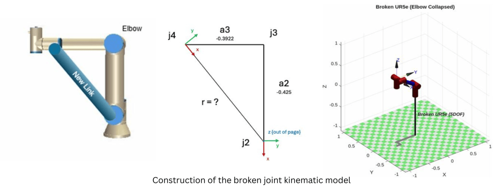
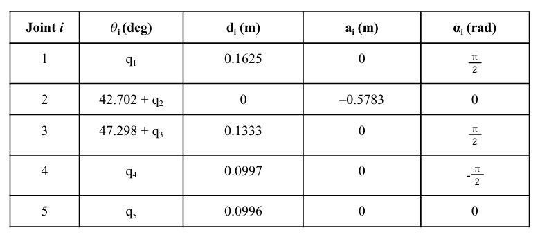

# UR5e Kinematics

Small MATLAB sandbox for exploring **manual kinematics of a UR5e-style arm** - forward kinematics, Jacobians, singularities, and simple inverse kinematics.

---

## Features

- **Broken UR5e forward kinematics**

  - `BrokenArmKinematics.m`  
    - Treats the UR5e with an elbow joint locked at 90° (effective 5-DOF arm).
    - Reads a joint configuration (excluding the fixed elbow), reconstructs the full 6-joint vector, and computes the end-effector pose from first-principles DH transforms.
    - Optionally sends the motion to a real/virtual UR5e via RTDE and compares the predicted pose to the measured TCP pose.
  - `fiveJointModel.m`  
    - Builds a 5-joint SerialLink model in the Robotics Vision Toolbox using UR5e DH parameters.
    - Evaluates and prints the home pose (XYZ + RPY) and plots the “broken-elbow” arm in MATLAB.



- **Jacobian-based joint velocity estimation**
  - `jointVelUsingJacobian.m`
  - `joint_pos/`, `TCP_vels/`  
    - Loads sample joint position and TCP velocity logs.
    - Reconstructs an unbroken 6-DOF UR5e model from DH parameters.
    - Computes the spatial Jacobian at each sample and back-solves joint velocities via `pinv(J) * V_tcp`.
    - Prints which joint reaches the highest angular velocity, its value, and the sample index.

- **Singularity visualisation for a 3R arm**
  - `UR5e_SingularityFinder.m`  
    - Defines a simple 3-link revolute manipulator symbolically.
    - Derives and simplifies the linear-velocity Jacobian.
    - Plots `det(J_v)` over \(\theta_2,\theta_3\) and highlights singular curves where mobility is lost.

- **Planar inverse kinematics example**
  - `InverseKinematicsUR5e.m`  
    - Implements kinematic decoupling for a 3-link planar arm to reach a desired wrist-centre point \(p_c\).
    - Solves analytically for \(q_1, q_2, q_3\) (elbow-up and elbow-down branches) and verifies with a small FK check.

- **Report**
  - `Report.pdf` – a short write-up of the modelling steps, derivations, and results.

---

## Getting Started

1. Clone the repository:

```bash
git clone https://github.com/darshan-k-s/UR5e_Kinematics.git
cd UR5e_Kinematics
```
2. In MATLAB, add the folder to your path:
```bash
addpath(genpath(pwd));
```
3. Ensure you have:
- The Robotics Vision Toolbox (for Link, SerialLink, tr2rpy, etc.).
- An RTDE client class (rtde.m) on your path if you want to talk to a real or simulated UR5e.

---

## Typical Entry Points
- `BrokenArmKinematics.m` – interactive forward-kinematics check for an elbow-locked UR5e against a real/simulated robot.
- `fiveJointModel.m` – builds and visualises the equivalent 5-DOF SerialLink model.
- `jointVelUsingJacobian.m` – loads log files, computes joint velocities from TCP motion, and reports the peak angular speed.
- `UR5e_SingularityFinder.m` – explores Jacobian singularities for a simple 3R arm.
- `InverseKinematicsUR5e.m` – demonstrates closed-form IK with elbow-up / elbow-down solutions.

